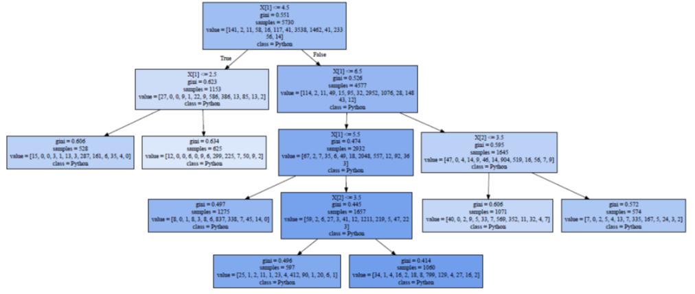

# Decision-Tree-Python
This is an assignment from my big data course in 2017. This is also my 1st workout after stepping into data science.
Raw data is come from Kaggle which conducted an industry-wide survey of data science in 2017 with over 16,000 responses and from  171 countries and territories. Decision Tree training model (Gini Index) writthen in Python is selected for predicting class of the most recommended language in data science industry.

## Problem statement 
What kind of tools are good to learn for anyone who aspire to have further career advancement in data science industry?

The following are the features X[ ] choosen from the survey data:
1. Industry
2. Employment
3. Job title

The most recommended language in data science industry as the Y[ ]

## Result
No matter which features, **Python** is the most recommended language in data science industry. 

